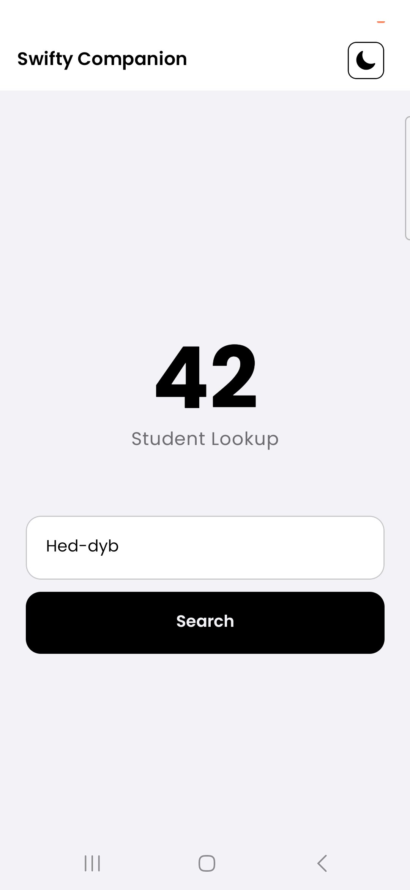
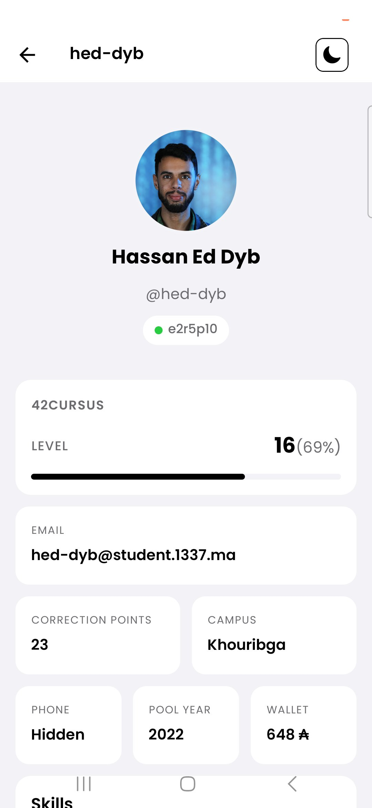
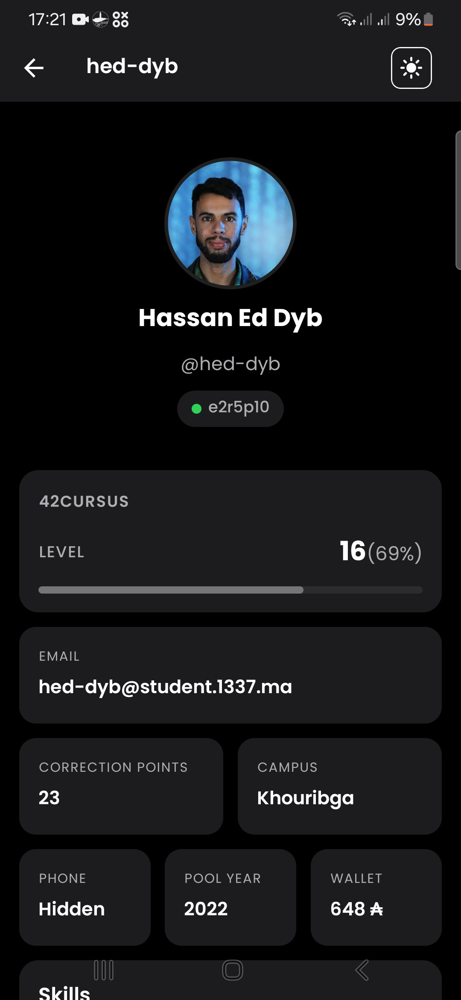
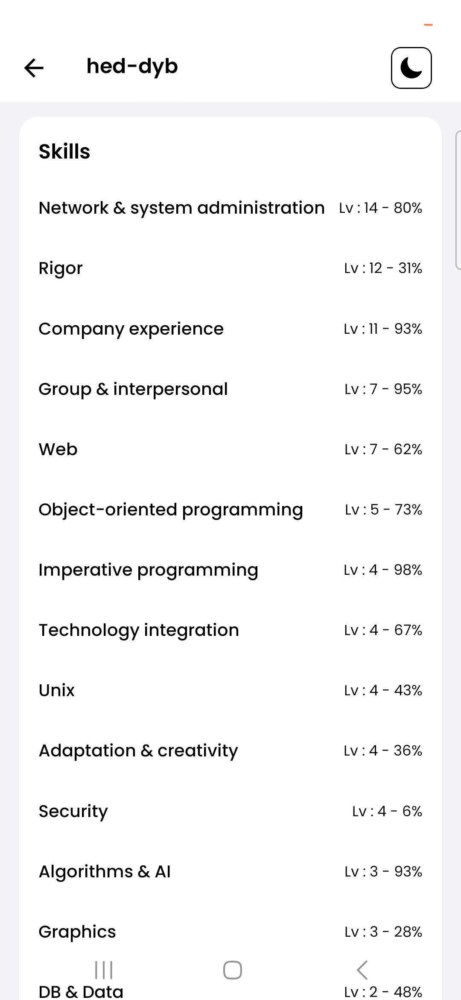
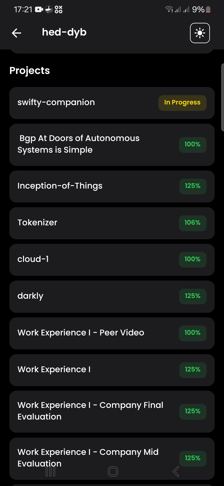

# Swifty Companion

This is a **42 Network** project. Swifty Companion is a mobile application built with React Native and Expo that allows you to search for 42 students and view their profiles, skills, and projects using the 42 API.

## Prerequisites

Before running this project, please ensure you have the following installed:
* **Node.js**: You must have the latest version of Node.js installed on your operating system.
* **Expo Go**: Download the Expo Go app on your iOS or Android device to scan and run the app.

## Setup and Installation

1. **Clone the repository** (if you haven't already) and navigate to the project directory.

2. **Configure Environment Variables**
   You need to provide your 42 API application credentials. Look for the .env file in the root directory (or create one) and fill in your details:
   ```env
   CLIENT_ID=your_42_client_id_here
   CLIENT_SECRET=your_42_client_secret_here
   ```

3. **Install Dependencies**
   Run the following command to install all required packages:
   ```bash
   npm install
   ```

## Running the Project

Once your environment is set up and dependencies are installed, start the application by running:

```bash
npx expo start
```

### Viewing the App
* **Mobile Device (Expo Go):** Scan the QR code that appears in your terminal. **Note:** Your phone and your computer *must* be connected to the exact same Wi-Fi network for Expo to connect successfully.
* **Web Version:** Alternatively, you can try the web version by following the localhost link provided in the terminal output (e.g., press `w` in the terminal to open it in your browser).

## Screenshots

Here are some previews of the application:

<p align="center">
  
  
  
  
  
</p>